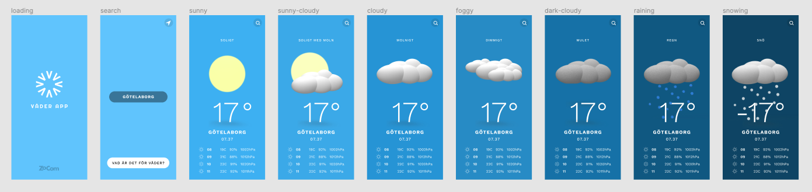

# Väder App
**App som visar väder utifrån ortsökning eller geolocation.**

## Bakgrund
Vi är väldigt beroende av vädret. För att veta hur man ska klä sig när man sätter sina fossingar utanför dörren så räcker det inte att man tittar ut, man måste även konsultera tekniken! 
Ert uppdrag är att utifrån bifogad figma-skiss bygga en enklare Väder-App som på ett snitsigt sätt visar nuvarande väder samt 4h framåt. Om du föredrar Figma online hittar du en mockup [här](https://www.figma.com/file/UjdgkYeIRK0j7llidVguIN/Weather-App?node-id=0%3A1).


## Tekniska krav
- Följ så noga som möjligt Figma mockup ( bifogad )
- Bygg er väderapp i React.js
- SCSS för styling
- Funktionella komponenter
- Statehantering med Redux


### Väderdata API
Det finns många väder API:er och ni är fria att använda ett ni anser passa. 

Vi rekommenderar [Open Weather Maps API](https://home.openweathermap.org/) där ni gratis kan göra sökningar på såväl ortsnamn som geografiska koordinater ( lat, lon ). 

För att kunna intergera med APi:et krävs det att ni registrerar er och hämtar ut en ```API key```.

## Level ups

### Geolocation
Utöver sökning på ortsnamn skall man kunna söka med hjälp av geo-positionering hämtad med hjälp av [geolocation](https://www.w3schools.com/html/html5_geolocation.asp).

### Längre tidshorisont på prognoser
Visa en egen vy där man ser kommande 4 dagarna istället för 4h.

### Dark theme
Se till att appen även kan hantera ett mörkt tema. Ni väljer själva färger, men se till att tänka på läsbarhet och kontraster.

### Superawesome animations
Använd (3d?) animeringar och transitions för att liva upp er app lite.

## Screens

